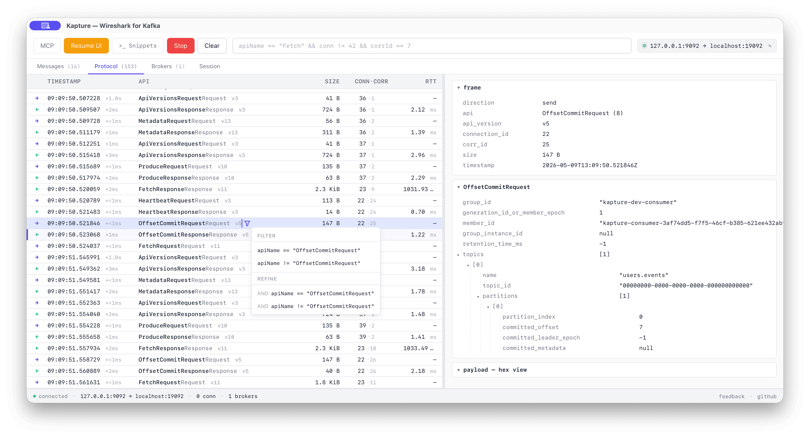

# Kapture

**Wireshark for Kafka.** A desktop app that speaks the Kafka protocol natively, intercepts the traffic between your client and the broker, and shows you what's really going through the wire.



## Why

Most engineers building apps on Kafka have no good way to see what their clients actually do. Logs and dashboards don't show protocol exchanges, and topic browsers (Conduktor Console, Redpanda Console, AKHQ, Kafdrop) show data at rest, not the wire.

That's where the bad patterns hide:

- `OffsetCommit` after every single record.
- A fresh producer (full `ApiVersions` + `Metadata` + `InitProducerId` handshake) per record. [[example]](https://www.pagerduty.com/eng/august-28-kafka-outages-what-happened-and-how-were-improving/)
- A `Metadata` storm because someone disabled the cache.
- Tiny Produce batches behind a high message rate (`linger.ms=0` + tiny `batch.size`). [[example]](https://cwiki.apache.org/confluence/display/KAFKA/KIP-1030%3A+Change+constraints+and+default+values+for+various+configurations)
- A consumer group rebalancing every few seconds because the heartbeat config is wrong. [[example]](https://medium.com/@nishada/fixing-kafka-stream-consumer-rebalancing-babda7f2e333)

Invisible from logs. Obvious once you see the protocol.

If you debugged HTTP with Fiddler ten years ago, this is the same idea, for Kafka.

## How it works

Kapture runs a local TCP proxy. You point your Kafka client at `127.0.0.1:9092` (instead of your real broker), Kapture forwards every byte upstream, and copies a decoded view into the inspector.

```
your client ──▶ 127.0.0.1:9092 ──▶ real broker
                    │
                    ▼
                Kapture inspector (live)
```

No instrumentation, no SDK swap, no broker plugin. The client doesn't know it's there. SASL/PLAIN, SASL/SCRAM-SHA-256/512, TLS, and mTLS upstream are all passed through correctly.

## What you get

- **Live wire view.** Every Kafka API request/response decoded — `corr_id`, RTT, payload size, full body tree. Apache Kafka 4.x compatible (including KIP-516 topic IDs and KIP-932 Share Groups).
- **Messages tab.** Decoded records flattened from Produce requests and Fetch responses. Each record back-links to the frame it rode on so you jump from the message to the wire in one click.
- **Filter DSL.** Wireshark-style: `topic == "orders" && envelope.size > 1024 && headers.tenant == "acme"`. Compose, autocomplete, save.
- **Connection profiles.** Bootstrap, TLS, SASL — saved locally; passwords in the OS keychain. Last-used profile is pre-selected on launch.
- **Bonus: agent-driven.** A local MCP server (`http://127.0.0.1:7878/mcp`) exposes capture / filter / inspect tools so an IDE agent (Claude Code, Cursor, Windsurf) can drive Kapture for you. SASL frames redacted before they cross the boundary.

## Install

Download the latest bundle from [Releases](https://github.com/sderosiaux/kapture/releases/latest), unzip, and drag `Kapture.app` to `/Applications`. The app self-updates on each launch.

> macOS only at the moment. Linux / Windows planned.

In the Connection dialog: point Kapture's listener (default `127.0.0.1:9092`) at your upstream broker (Confluent Cloud, MSK, your local docker, …). Configure SASL/TLS if needed. Hit Start. Then point any Kafka client at `127.0.0.1:9092` and watch.

Building from source: `pnpm install && pnpm tauri dev`.

## Roadmap

- **Pattern detector.** Spot the anti-patterns above (overcommit, producer-per-record, metadata storm, tiny batches, rebalance loop) and surface them as Wireshark-style "Expert info".
- **Chaos.** Inject latency, error codes, connection drops at the proxy layer to validate client behaviour under adversarial conditions. Toxiproxy, but Kafka-aware.
- **Time-travel debugger.** Breakpoints by predicate against Kafka Streams / Flink consumers; step through messages; inspect state stores.

## Changelog

See [CHANGELOG.md](CHANGELOG.md) for the full feature inventory grouped by area, plus what's brewing on `main`.

## Feedback

- Email: [stephane@conduktor.io](mailto:stephane@conduktor.io)
- Issues: https://github.com/sderosiaux/kapture/issues (will move to `conduktor/kapture`)

## License

Apache-2.0.
